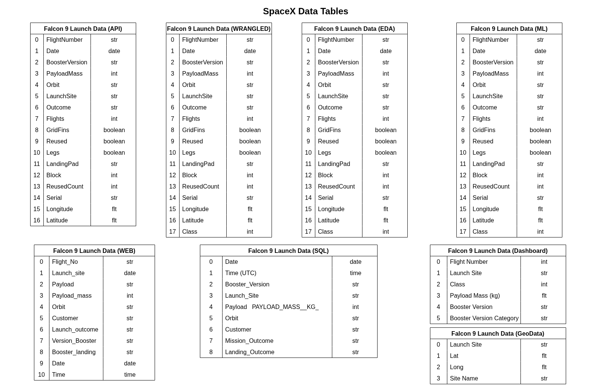

# Project Overview

This repository contains the **Data Science and Machine Learning Capstone Project (IBM DS0720EN)** offered by EDX (the course is now closed as of January 30, 2026). In this capstone, the role of a professional data scientist is assumed while working for a fictional aerospace company called **SpaceY**. The founder of SpaceY, Allon Musk, has tasked the data science team with **analyzing historical launch data to determine and predict the cost of each SpaceX Falcon 9 rocket launch**.  To accomplish this, launch data was systematically gathered through multiple acquisition methods including: REST API integration, web scraping, and SQL database queries.

The project applies real-world data science workflows, ranging from data collection and cleaning to exploratory analysis and machine learning, to develop meaningful insights and a predictive model. The following sections of this repository provide a complete overview of the methodology, analysis, and results of the project.

# Project Background

SpaceY is a start-up commercial aerospace manufacturer and space transportation company seeking to compete in the rapidly evolving private spaceflight industry. SpaceY is focused on developing cost-effective solutions for satellite deployment, cargo resupply missions, and eventual crewed spaceflight operations. The company's business model centers on competitive contract bidding against established players like SpaceX, making accurate cost estimation a critical competitive advantage.

For SpaceY to compete effectively, accurate predictions on whether a Falcon 9 first stage will successfully land, are needed to inform SpaceY's pricing strategy when bidding against SpaceX. Accurate predictions will also drive the design features of the future SpaceY rocket program.

This project focuses on delivering actionable insights and predictive capabilities in three strategic areas:

- **What are the key technical, operational, and environmental factors that determine the success or failure of a Falcon 9 first-stage landing?**  
  Through exploratory data analysis of historical launch records, we identify influential variables such as payload mass, target orbit type (e.g., LEO vs. GTO), launch sites, and booster version.

- **Can these factors be systematically analyzed to develop a reliable predictive model?**  
  Yes. By applying structured data science workflows (cleaning, feature engineering, visualization, and statistical testing), we confirm strong correlations and build a model capable of forecasting landing outcomes with high confidence, providing decision support for mission planning, customer bidding, and risk assessment.

- **Which machine learning model delivers the highest accuracy in predicting successful rocket landings?**  
  Multiple classification algorithms were evaluated (including logistic regression, decision trees, SVM, and KNN), with hyperparameter tuning and cross-validation to identify the best performer. The top model offers strong predictive power, helping SpaceY optimize reuse strategies and maintain cost leadership.      

Below are links to the key project documents:

> A **PDF** of the final presentation can be found here. The original **Power Point** slides is found [here](). **`TODO: ADD LINKS TO PDF AND PP`**
      
> The notebook used to **fetch SpaceX data from a Rest API** is found [here](https://github.com/iacisme/Spacex-EDX-Capstone-/blob/main/notebooks/01_jupyter-labs-spacex-data-collection-api-v2.ipynb).

> The notebook used to **web scrape Wikipedia** is found [here](https://github.com/iacisme/Spacex-EDX-Capstone-/blob/main/notebooks/02_jupyter-labs-webscraping-v2.ipynb).

> The notebook used for **data wrangling using Pandas** is found [here](https://github.com/iacisme/Spacex-EDX-Capstone-/blob/main/notebooks/03_jupyter-labs-spacex-Data%20wrangling-v2.ipynb).

> The notebook used for **EDA using SQL** is found [here](https://github.com/iacisme/Spacex-EDX-Capstone-/blob/main/notebooks/04_jupyter-labs-eda-sql-edx-sqllite-v2.ipynb).

> The notebook used for **data visualization using Seaborn / Matplotlib** is found [here](https://github.com/iacisme/Spacex-EDX-Capstone-/blob/main/notebooks/05_jupyter-labs-eda-dataviz-v2.ipynb).

> The notebook used for **Map Analytics using Python and Folium** of each launch site is found [here](https://github.com/iacisme/Spacex-EDX-Capstone-/blob/main/notebooks/06_jupyter-labs-launch-site-location-v2.ipynb).

> The notebook used for **developing an interactive Dashboard using Plotly-Dash** is found here. The **Python script**, to launch the program using the command line, is found [here](https://github.com/iacisme/Spacex-EDX-Capstone-/blob/main/notebooks/07_jupyter-labs-spacex_dash-app.ipynb).

> The notebook used to **build and train a machine learning model** is found [here](https://github.com/iacisme/Spacex-EDX-Capstone-/blob/main/notebooks/08_jupyter-labs-SpaceX-Machine-Learning-Prediction-Part-5-v1.ipynb).

# Data Structure & Initial Checks

Data for this project was gathered and collected using multiple data sources, including a **Rest API**, **web scraping**, and data downloaded from Amazon S3 buckets. A description of each table is given below:
* **Table: Falcon 9 Launch Data (API)** - API Details can be found here: https://github.com/r-spacex/SpaceX-API
* **Table: Falcon 9 Launch Data (Web)** - Downloaded from Wikipedia: https://en.wikipedia.org/wiki/List_of_Falcon_9_and_Falcon_Heavy_launches
* **Table: Falcon 9 Launch Data (Wrangled)** - This data set was updated to include the `class` field
* **Table: Falcon 9 Launch Data (SQL)** - Obtained by connecting to an SQLite server, and performing queries to aquire data
* **Table: Falcon 9 Launch Data (EDA)** - Obtained by connecting to an Amazon S3 bucket 
* **Table: Falcon 9 Launch Data (GeoData)** - Obtained by connecting to an Amazon S3 bucket
* **Table: Falcon 9 Launch Data (Dashboard)** - Obtained by connecting to an Amazon S3 bucket
* **Table: Falcon 9 Launch Data (Machine Learning)** - Obrained by connecting to an Amazon S3 buckter

Below is an overview of each of these data tables.

# Executive Summary

The following are the key findings of this project:

1. The Falcon 9 Block 5 booster version is the only booster version designed to be fully reusable, and is the principle factor in predicting a successful landing
2. The key drivers for selecting a launch site are:
    - Manned vs. unmanned flights. KSC LC-39A is the only launch site capable of launching manned space missions 
    - Orbit requirements
3. An accurate machine learning model can be developed to predict successful launch / landing of a Falcon 9 booster

# Insights Deep Dive

Refer to the presentation found here for the analysis and deep dive on the analytics for this project. **`TODO: ADD LINKS TO PDF AND PP`**
